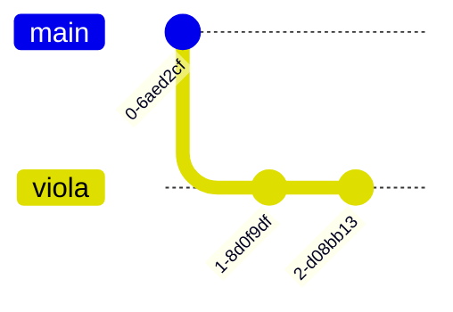

# GITGUD

![YOU DIED](data:image/png;base64,iVBORw0KGgoAAAANSUhEUgAAASwAAACoCAMAAABt9SM9AAAAtFBMVEUAAAAAAAIiDg0DAAAKAABoJiBnKSFrKCNkKSFCGhpqKidnJyQMAABoKSMVCQlmKCNiKiZcJyVMHx9DGx07GBhXIiBkKiZmKCdPJCFPHh8cBgVgKSNhJCJAFxZTIyEoDA41FRNIHxkuFRAqExMTAAQaDQtQJCNFGBdcKCNUICIjDw03GRclCwxEHiNAFxlLHSExFRpXKipLIhk/HRk3ExBeKyE5Gx9PHhhgKi09GxJIGh1NGRo19neaAAAII0lEQVR4nO2aaXfjqBKGsfbVaMeSrC3e5KWdZOzuTif//3+NZG0IJzPTfe90dObU88VgA4aXoiiQEAIAAAAAAAAAAAAAAAAAAAAAAAAAAAAAAAAAAAAAAAAAAAAAAAAAAAAAAAAAAAAAAAAAAAAAAAAAAAAAAAAAAPhtzH7xt4/hmSz/frHZ7Nea/738bB/5d5P/LYQvoZqcz6+v5+iWn39xKsLHOboNmo9y99EJvRPfy7c6J2fv7LruqangOq53TrxB3NWzbadhGKYL2/b3Rb4Z/uzJ8455jcehKMuy0+nERdwpu8FFVRvG1lruUycM/dS27b2aGb9Nir+HX6mBaZrp2Zs3+Sj3ZTlt+xgVz9+yaBO5z1/zrsaD84csykpRjbdGWC00mThPVJPcJTYl4nh5om5tU7GKqPvpSS1sXdNs1YvQyvEDQrSyTBtszRaqCVnnKTF1370mSVVAV9IcTQmPEGvdpusVtBGXxs2MeM8uWrMwimAh9EvT0fSHvvoMJZhjmrxqStFWzJ81Oc5uLc/qBjalWPKosdM8wH6/ZqM4Fpo+2HLczBw6FF+x5kzJuNBW0j3KR2Xk0CTORB0KnYOt0KU9THpjqSrOXwzGT3FYPHdp4TFQSN6VRWtb87s/O1jSbqjkLIWmyILE667Bla3jxRpNh4zoqTBkQ7UZzNn0qV4ae83t0p6yHBxR/RM795wkUjq7pk5OXWZt636XHok1e/B7sTpLrxTjbEzcKW0Z2zjO+wy3b9ZAZFkPg73xKLKDVZvxguWcqi5UNcabJ2fSYvELzfQ7Pdc2Tt+3LMNpZ2wQq4ocEPdMXobefT4nS/J703Ly5lPVnqkJrYa307ftGLyAjMTy50w0dBJpsVD0Ykptq5VYygK1xTeWSYnFf2sFLTSLXniXANsTclt8KuLOY0ft/Eax6Y1LZSJp9zxGLP5OrMNIrBn6RkS7Hf/HYqF5OzmFbtNiGaWiHX96TP8emSItWtP6cqqtqNri5CAaFzJsOW2GU+2ftFgoZcWqfBalNF8pJOp5k7mJ1bKJtR26p8DL0V97WCkn5bX0IK8/Z9GicShCLN91MJWtZhCezoi1/kuxKkJZd5rU2qLF0gex5v3fFcpYrFOgWGxw8nnM0IqIzRCcrBGLC/QtW0w1tWYdqngsVhixDl4SL6MvchMvm6W1tnDYfbspO8viqwhjCOOksViGbWLGJXwue9HKqi5vinZ+PUVy2TIeNt2bu9nh0W6I1A1T8s6yTjFpowdhqVFiBU6XXg9zE4pjsZBD8AJNiJzc1smljUcr47mfzNVX6RHxtVjj0AE592LJ49rrkuD8ljIs7bH7lhYr2veF78Q6aor9z4fy78Pv5ZhDp77voa6t2DKchctbYodtSqwZKjh2GSqj0KE+wuh6I5+xlHtZNrHSF8tGYq1H7R0JjicUPNSmhV2kZl22Eitji0QWXt4SO8X6SbGQbbYLUxiLtbxcVHVXFN/xh2LxlUfF8ciUP5vqOGPlX/rs+2IpnVg/a1m1WMktIdgjsXzVdV1VVUPSH4LuLSufmlhV4Ghahz7nvCNWtYU3I1IZsRx2Y39HLHkQq5eFXobuIJZT+ayxWMG0xJpVG7RE9agS68SW+VCs9H8Wi0fZINbuzrImJhaqw6iSzih3uyEXSM3+niiEkqdahqyuB5MRS7CxnLepQay5NViWEfZB6Y7dDfNAsacUwqM6jKLEynVTZQvkptR8dx6LNft7seYWbm8IPxILuf1R/k6si4YdNC0qsYbpOxA5ZQuochsrnSUyWnh3PusgMWKtArxsxKAdPCXWDD0ZqL3nZyN4tMXapCJ4VB+PKVsXbNFiQ5uFaDXRpyeRURDmMEdudFDGtw7VROj7rmF9EIty8NTDMMdkjjsl838TQKXFqs9/TAcNX2+N7cx0PmS9751YvtQdCEZilZhZrbeGWMtaBaYtoGmREMpnIS5mBoI4U28luopjsfaIgVNoj1dHlWI8bza4kc8K5LEvOt5O5Clejtb1QtKntgpRotNioUJ5GT8oSOTukcUp0HLqh+gRMXAKLuj8VjSTNlmJ9b37mhXLaB4FMGI9xOYLu84/HTUoaWPnbOKi/p6qisPi4NAG6nNbpq3u6e4ek8MjsTyCy054o/zYsrJmmaeSTm2vQiqSuwuQT+cSWCPfk+ujK7fE7J9uoUKmb8X3d/N+1HGvyAytLHl4IGLEUr/NVmKFdLWika6UzL44EhamnE7NY9U7VjB21IWcDpLkFnWdx8XDczH0zbl7MeJI8PDwa1XK1APIeSANDj6QX6laJ6u5CrQl3em2mvUCiyV7t/j5GKkYH0YvhAivxG6NhvdeRj62vqNohDR2tjAey6w+LClB2r484RJsUXWPihQ88GhWqxHFIhXMHVLz9sQyiiWFeLd2hFWqBf50rpQbNsnbUjJxuUhG21zmpz+yKDpd0i0TpD/Ecnm55j++Wws2HFu5viyKpkbCJEl8XQ6cti7PHxe2hU1RUcINiq67qhzZOo5TFLu30A70yhPOj9+rApJJnl3Pe7Wx5OeTusmqOamv6sV7ypOE2aRPP3aq61xvNxAj+1kn5XJJ4jDn2Teo3NApKpk8tX4fx1FXRl+T57JKeo7jDtkcPb2+7RIvz71rcr3mzYs0a8Rddq9Joqrq7u0tDHdXbnru6tcw5vP/ylB+hY+O9v9v//pXr/Pdjj0fvQgIAAAAAAAAAAAAAAAAAAAAAAAAAAAAAAAAAAAAAAAAAAAAAAAAAAAAAAAAAAAAAAAAAAAAAMBv4U82GJbHecvXvgAAAABJRU5ErkJggg==)

[TOC]


## Cos'è il controllo del versionamento del codice

Persone diverse stanno lavorando a un progetto che presuppone di scrivere del codice. Modifiche fatte in parallelo da persone diverse potrebbero essere in conflitto se agiscono sulla stessa linea di codice: diciamo che l'utente `A` scrive in `file.txt`:

```
le rose sono rosse
```

Nello stesso momento `B` scrive invece


```
le rose sono blu
```

Chi ha ragione? Come fanno `A` e `B`a mettersi d'accordo su quale delle due versioni del file `file.txt` va usata nel progetto?

Per risolvere questo problema serve una maniera di rappresentare univocamente le varie versioni in cui un file di codice evolve nel tempo; l'ideale sarebbe rendere possibile tornare indietro a una versione precedente dopo aver sperimentato qualcosa che si è rivelato fallace, e risolvere quanto più automaticamente possibile i conflitti come quello sopra.

Hence git.

## Cosa è una repo

Un "repo" è un apparato che risolve il problema di rappresentare la storia di modifiche successive potenzialmente divergenti ad una base di codice.

L'entità fondamentale è il DIFF, ovvero le differenze nel codice tra una versione e quella precedente.

Internamente il repo è rappresentato come un grafo diretto aciclico, ed in particolare ai suoi nodi sono associati i DIFF, oltre ad alcuni metadati.

I metadati includono timestamp, nome utente, ed un hash crittografico calcolato sulla concatenazione di metadati, DIFF, e hash del nodo genitore.

Questo fa del repo un [Merkle tree](https://it.wikipedia.org/wiki/Albero_di_Merkle).

Sebbene i nodi rappresentino DIFFERENZE, è uso comune trattare i loro hash univoci come se si riferissero allo stato dell'intera base di codice nel momento in cui il nodo è stato creato (ovvero, la somma delle differenze di tutti gli ancestors del nodo).

Gli hash sono riferimenti univoci e immutabili a "stati" del codice, ma non sono pratici nell'uso quotidiano.
Questo è il motivo per cui l'albero viene decorato con delle etichette mobili (che prendono il nome di branch o tag a seconda del modo in cui vengono spostate). Più dettagli di seguito.

## Dove è una repo

Ogni cartella di un computer può essere resa una repo.

Se si trova sulla propria macchina viene chiamato repository o origin **locale**.

Se si trova sulla macchina di qualche servizio di hosting (e.g. GitHub, BitBucket, GitLab, ...) viene chiamato repository o origin **remoto**.

La differenza non è nella struttura ma nell'utilizzo: i repo remoti sono tipicamente quelli di riferimento utilizzato per la condivisione del codice tra vari utenti.

Infatti gli utenti possono creare una versione locale del repo remoto, applicare delle modifiche, e spingerle poi verso il repo remoto per condividerle (o confrontarle e riconciliarle) con gli altri.


## Come si usa una repo (da soli, con git)

Il principale servizio che ospita repository remote è [GitHub](https://github.com/).

Lo strumento principale con cui si manipolano repository locali è [git](https://git-scm.com/).
Si tratta di una commandline utility, e nel seguito esamineremo i principali comandi.


### Clonare una repo

Per creare una copia locale di un repository remoto il comando da utilizzare è **`clone`**; il parametro importante da fornire è l'indirizzo del repository remoto:

```bash
$ git clone git@github.com:Progetto-ItaCa/libro.git

Cloning into 'libro'...
remote: Enumerating objects: 12, done.
remote: Counting objects: 100% (12/12), done.
remote: Compressing objects: 100% (11/11), done.
remote: Total 12 (delta 3), reused 0 (delta 0), pack-reused 0
Receiving objects: 100% (12/12), 5.78 KiB | 5.78 MiB/s, done.
Resolving deltas: 100% (3/3), done.
```

Il comando crea una cartella col nome del repo, ed all'interno è possibile trovare il codice. Con il comando **`log`** è possibile esaminare una lista delle ultime modifiche:

```bash
$ cd libro
$ git log

commit b943a2bd7eb13e35ba9fa194d2beced4d377a1f1 (HEAD -> main, origin/main, origin/HEAD)
Author: fouche <fosco.loregian@gmail.com>
Date:   Sat Mar 26 11:21:36 2022 +0200

    Rename main.tex to sample.tex
```

Il testo `Rename ...` è un esempio di un *commit*; un commit è una stringa di testo che descrive i cambiamenti che sono stati fatti sul codice dall'`Author`. Ogni commit è identificato da un codice alfanumerico `b943a2...77a1f1` che permette di riferirvisi se necessario.

L'indicazione `HEAD` denota che lo stato dei file nella cartella è quello corrispondente al momento della creazione del commit. In altri termini: `HEAD` indica lo stato storico del repo su cui i file nella cartella sono "sintonizzati".

L'indicazione `main` denota il `branch` di lavoro corrente; si tratta di una etichetta mobile che individua un certo "filone" di sviluppo.

Le indicazioni `origin/*` hanno un significato analogo, ma in relazione allo stato del repository remoto.


### Modificare una repo

Immaginiamo che lo stato dei file locali sia il seguente:

```bash
$ ls -l

-rw-r--r-- 1 fouche fouche   33 Mar 27 16:52 README.md
-rw-r--r-- 1 fouche fouche  309 Mar 27 16:52 beauty.py
-rw-r--r-- 1 fouche fouche 4652 Mar 27 16:52 itaca.sty
-rw-r--r-- 1 fouche fouche 1538 Mar 27 16:52 sample.tex
```

`git` può darci delle informazioni sullo stato della repo col comando `status`:

```bash
$ git status

On branch main
Your branch is up to date with 'origin/main'.

nothing to commit, working tree clean

```

`On branch main` informa l'utente di quale branch sta abitando.

`Your branch is up to date with 'origin/main'` significa che il repo locale in questo momento è sincronizzato con quello remoto.

`nothing to commit, working tree clean` significa che non ci sono nuove modifiche apportate ai file rispetto a quanto già contenuto nel repo.

Se apportiamo dell modifiche ai file (modificando un singolo file, cancellandone uno, creando una cartella...) come possiamo aggiornare lo stato del repository in modo che gli altri utenti che collaborano al progetto vedano queste modifiche?

Innanzitutto, osserviamo che `git status` è sensibile alle modifiche fatte: se vogliamo modificare il file `README.md`

```
# libro
Il grande libro di ItaCa
```

in

```
# libro
Il meraviglioso libro di ItaCa
```

dopo aver fatto questa modifica e salvato il file, `git status` ci avverte che è cambiato qualcosa:

```bash
$ git status

On branch main
Your branch is up to date with 'origin/main'.

Changes not staged for commit:
  (use "git add <file>..." to update what will be committed)
  (use "git restore <file>..." to discard changes in working directory)
	modified:   README.md

no changes added to commit (use "git add" and/or "git commit -a")

```

"Changes not staged for commit" suggerisce che ci sono delle modifiche che è possibile mettere in `stage` per effettuare un `commit`. Questo è il primo passo della sequenza di azioni per pubblicare le proprie modifiche.

Lo `stage` è un "palco" su cui è possibile posizionare le modifiche fatte ai file tramire il comando `git add`.

```bash
$ git add README.md
$ git status

On branch main
Your branch is up to date with 'origin/main'.

Changes to be committed:
  (use "git restore --staged <file>..." to unstage)
	modified:   README.md

```

`git commit -m <MESSAGGIO>` è il comando con cui si conferma la volontà di aggiungere le modifiche messe in _stage_ al repo annotandole con un `<MESSAGGIO>`:

```bash
$ git commit -m "edit README.md"

[main eeea38c] edit README.md
 1 file changed, 1 insertion(+), 1 deletion(-)

$ git status

On branch main
Your branch is ahead of 'origin/main' by 1 commit.
  (use "git push" to publish your local commits)

nothing to commit, working tree clean
```

"Your branch is ahead of 'origin/main' by 1 commit" ci conferma che il repo locale contiene un commit in più rispetto a quello remoto. Si tratta di quello che abbiamo appena creato.

Possiamo finalmente pubblicare le nostre modifiche col comando `git push`:

```bash
$ git push
Enumerating objects: 5, done.
Counting objects: 100% (5/5), done.
Delta compression using up to 16 threads
Compressing objects: 100% (2/2), done.
Writing objects: 100% (3/3), 297 bytes | 297.00 KiB/s, done.
Total 3 (delta 1), reused 0 (delta 0), pack-reused 0
remote: Resolving deltas: 100% (1/1), completed with 1 local object.
To https://github.com/Progetto-ItaCa/libro.git
   b943a2b..eeea38c  main -> main

$ git status

On branch main
Your branch is up to date with 'origin/main'.

nothing to commit, working tree clean
```

A questo punto se un altro utente clonasse il repo riceverebbe anche la nostra modifica.

Cosa succede se però gli utenti hanno già una copia locale al momento del nostro push? Tramite `git status` possono vedere che sono "rimasti indietro":

```bash
$ git status

On branch main
Your branch is behind 'origin/main' by 1 commit, and can be fast-forwarded.
  (use "git pull" to update your local branch)

nothing to commit, working tree clean
```

"Your branch is behind 'origin/main' by 1 commit" significa che non hanno il commit che abbiamo appena pushato, e "can be fast-forwarded" li rassicura del fatto che possono riceverlo senza rischi di conflitti con il comando `pull`:

```bash
$ git pull

Updating b943a2b..eeea38c
Fast-forward
 README.md | 2 +-
 1 file changed, 1 insertion(+), 1 deletion(-)

$ git status

On branch main
Your branch is up to date with 'origin/main'.

nothing to commit, working tree clean
```

Possiamo chiedere a git di mostrare esplicitamente le modifiche applicate dall'ultimo commit col comando `diff`:

```bash
$ git diff HEAD^

diff --git a/README.md b/README.md
index 88c3a71..89cc611 100644
--- a/README.md
+++ b/README.md
@@ -1,2 +1,2 @@
 # libro
-Il grande libro di ItaCa
+Il meraviglioso libro di ItaCa
```

Possiamo vedere che è stata rimossa la riga che inizia con `-` ed sostituita con la riga che inizia con `+` all'interno del file `README.md`.

Un modo più raffinato di agire sul codice consiste nel creare un differente "branch" dentro il quale modificare, creare, cancellare... file diversi. L'idea è che si dice a git di creare un'etichetta `viola` da portarsi dietro in ogni commit futuro.

Da master si diparte un nuovo "branch":


Si fanno dei commit in `viola`:



Al momento di confrontare il contenuto di `main` con il branch `viola` saranno possibili dei confronti più puntuali perché riguarderanno solo i commit etichettati con `viola`; questo rende più ordinato e chiaro il progresso del progetto (e GitHub ha una interfaccia intuitiva per gestire i conflitti).

```mermaid
gitGraph:
commit
branch viola
checkout viola
commit
commit
checkout master
commit
merge viola
```

Mentre noi lavoravamo su `viola` qualcuno ha modificato `master`: il conflitto va risolto! Spesso questo avviene automaticamente, perché `git` sa capire quale modifica precede quale altra. In questo caso, il contenuto di `master` e di `viola` possono essere riunificati (con un commit su `master` che solitamente inizia con `Merge pull request ...`).

* git branch
* git checkout -b

## Come si usa una repo (in compagnia, con GitHub)

Quando molte persone contribuiscono ad un unico repo accade naturalmente che ognuno produca una "storia" divergente da quella degli altri.

Supponiamo che un secondo utente abbia modificato lo stesso file `README.md`, in maniera diversa: per la sua copia locale, `README.md` contiene

```
# libro
Il brutto libro di ItaCa
```

Questo è un esempio di *conflitto* tra le versioni dello stesso file.

E' possibile riconciliare le due versioni? Si! E molta dell'utilità di `git` viene dai suoi algoritmi che nella maggior parte delle situazioni permettono di risolvere conflitti senza interventi manuali.

Nonostante questo, ci sono delle regole di igiene che è opportuno rispettare per minimizzare il rischio di conflitti complessi da risolvere.

* Lavora sempre su un branch tuo; `fouche/CH1-moar-diagrams`, `ivan/APPENDIX-comments`...
* Committa spesso, privilegiando piccole modifiche descritte chiaramente nei messaggi di commit. Quello che può accadere altrimenti è che il proprio lavoro venga sovrascritto dalle modifiche fatte da altri quando si pullano nella propria copia locale.
* Pusha spesso: il tuo branch è tuo, non ci saran conflitti col lavoro degli altri, ed il tuo lavoro sarà sempre al sicuro nel repo remoto.


Per effettuare le operazioni di riconciliazione del lavoro dei collaboratori è conveniente utilizzare l'interfaccia web di GitHub.
è possibile farlo anche localmente, ma su GH è semplice esaminare differenze, conflitti, e discutere in contesto di eventuali correzioni coi revisori.

## Cos'è (e come si usa) una pull request

Spesso chi vuole contribuire a una repo non ne ha completo accesso (per esempio per ragioni di sicurezza); se `A` vuole modificare il contenuto di una repo ad accesso ristretto deve prima creare un altro repo remoto a cui può accedere e che può modificare senza restrizioni (un "fork" del repo originario), per poi confrontare il fork con quest'ultimo.

Questa azione si chiama una "pull request": l'utente che ha forkato il repo originario domanda al suo proprietario `B` il permesso di mergiare i contributi dal fork al repo originario, mostrandogli le modifiche che ha fatto (alcuni commit del suo storico).

Questo è un esempio della lista delle PR sulla repo di agda-categories:


Ciascuna pull request è il contributo di `A` che chiede di collaborare al progetto passando per il vaglio preliminare di `B` che approva le PR dopo averle esaminate.

L'interazione tipica tra `A` e `B` è una cosa del genere

- `A` fa una PR
- `B` legge cosa contiene (guarda commit per commit in cosa consistono le modifiche fatte da `A`)
- se `B` le ritiene accettabili (e non ci sono conflitti), può decidere di mergiare i commit sottoposti da `A` nella sua repo
- se ci sono conflitti o `B` ritiene opportune delle ulteriori modifiche chiede ad `A` di eseguirle (GitHub permette di commentare in maniera puntuale -riga per riga- il codice dei commit in una PR)
- `A` esegue i cambiamenti chiesti
- ...
- finché a un certo punto (si spera) si converge al momento in cui `B` accetta la PR.

Quando `A` vuole forkare una repo, lo fa da GitHub e gli appare una copia della repo forkata nel proprio profilo; da lì, `A` clona una copia locale e agisce come al solito. In poche parole una PR permette di confrontare due branch di repo remote su cui persone diverse hanno agito e unificare il loro contenuto. Ad `A` quindi serve una copia in remoto del repo di `B`! Questo è ciò a cui serve un fork.